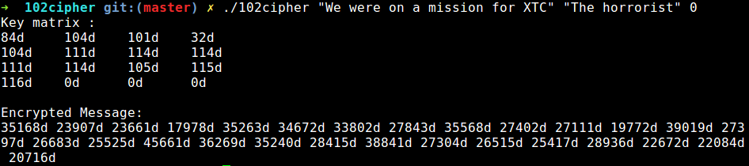

# 102cipher
Epitech first year project : [CPE] 102cipher
Second mathematic mudole project of the first year

Deadline : 2 weeks

Beginning of the project : 16/11/2015, 07h42

Group size : 2 person

Contributor : collet_j

# 102cipher

Cryptography is a very old science, whose goal is to secure communication, so that only its recipient could read it.

There are a lot of methods to encrypt a message, from the simplest (like the 2000-year-old Cesar’s code) to the
most complex (like the World War 2 Enigma code) ; they all need both encryption and decryption keys (sometimes
identical).

In some cases (such as the Hill cipher), the key is represented by a matrix.
You have to carry out such a matrix-based ciphering software, using the following process to encrypt :

1. transcript the key into numbers using the ASCII table,

2. convert the numbered key into a square matrix, the smallest possible size, and filling the lines first,

3. transcript the clear message into numbers using the ASCII table,

4. convert the numbered message into a matrix ; its number of columns should fit the key matrix size, and its
number of lines should be as small as possible,

5. multiply the 2 matrices, and write the answer linearly to get the encrypted message

* [Hill cipher](https://en.wikipedia.org/wiki/Hill_cipher)

## Getting started

These instructions will allow you to obtain a copy of the operational project on your local machine for development and testing purposes.

### Prerequisites

What do you need to install the software and how to install it?

```
gcc
make
```

### Installation

Here's how to start the project on your computer

Clone and go in the directory 102cipher

Project compilation

```
make
```

Running project

```
./102cipher message key flag
```

messsage  a message, made of ASCII characters

key       the encryption key, made of ASCII characters

flag      0 for the message to be encrypted, 1 to be decrypted

## Screenshot



## Build with

* [C](https://en.wikipedia.org/wiki/C_(programming_language))

## Auteurs

* **David Munoz** - [DavidMunoz-dev](https://github.com/davidmunoz-dev)
